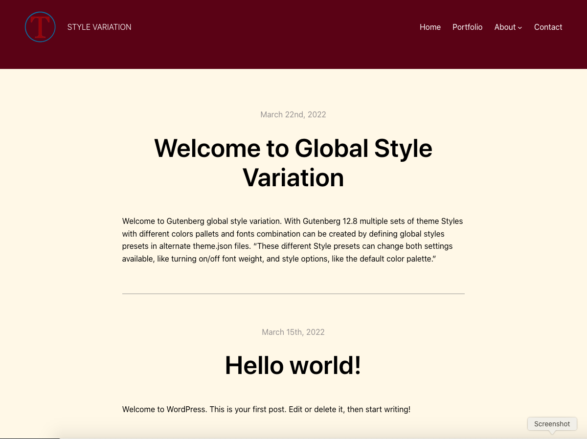

# TT2-gopher-blocks
A repository of [Twenty Twenty-Two](https://wordpress.org/themes/twentytwentytwo/)-based demo WordPress block theme created for the CSS-Tricks articles - [Creating Style Variations in WordPress Block Themes](https://css-tricks.com/creating-style-variations-in-wordpress-block-themes/), and [How to Create Patterns in WordPress Block Themes]().

**Note**: Repository for [Creating Block Theme Hero Sections with Dynamic Post Featured Image in WordPress project](https://css-tricks.com/?p=373057&preview=1&_ppp=39b4c6cfd9), please visit _**Branch-1**_.

It is intended as a learning demo only; not intended for distribution or use in production sites.



### Install this project locally
You can download the entire project or clone locally by running the following command from your terminal:

```
git clone https://github.com/tinjure20/TT2-gopher-blocks.git
```

It will create a directory in your project folder.


### If you are new to Block themes

This project is intended for those who have basic understanding of WordPress block themes and some familiarity of using Full Site Editor (FSE) interface. If you’re new to block themes and the FSE, you can get started here on CSS-Tricks with this [deep introduction to WordPress block themes](https://css-tricks.com/a-deep-introduction-to-wordpress-block-themes/#creating-wordpress-block-themes) and [site editor documentation](https://wordpress.org/support/article/site-editor/). This [Full Site Editing](https://fullsiteediting.com/) website is one of the most up-to-date tutorial guides to learn all FSE features including block themes and styles variations discussed in this article. 

### Other Useful Resources

* [Global styles presets](https://developer.wordpress.org/block-editor/how-to-guides/themes/create-block-theme/#global-styles-presets) (Block Editor Handbook)
* [Allow switching global styles variations #35619](https://github.com/WordPress/gutenberg/pull/35619) (GitHub)
* [Add initial version of the style engine #37978](https://github.com/WordPress/gutenberg/pull/37978) (GitHub)
* [Global Style Variations, “Skins” for Themes, Have Landed in Gutenberg](https://wptavern.com/global-style-variations-skins-for-themes-have-landed-in-gutenberg) (WP Tavern)
* [A Global Styles Switcher](https://critterverse.blog/2021/11/10/a-global-styles-switcher/) (critterverse.blog)
* [Global Styles panel: iterating on the "Browse styles" button #40478](https://github.com/WordPress/gutenberg/issues/40478)
* [A Look at Twenty Twenty-Two’s Upcoming Global Style Variations](https://wptavern.com/a-look-at-twenty-twenty-twos-upcoming-global-style-variations) (WP Tavern)
* [Exploring WordPress 6.0: Style Variations, Block Locking UI, Writing Improvements](https://www.youtube.com/watch?v=abaaVKl-beM) (Anne McCarthy - video) 